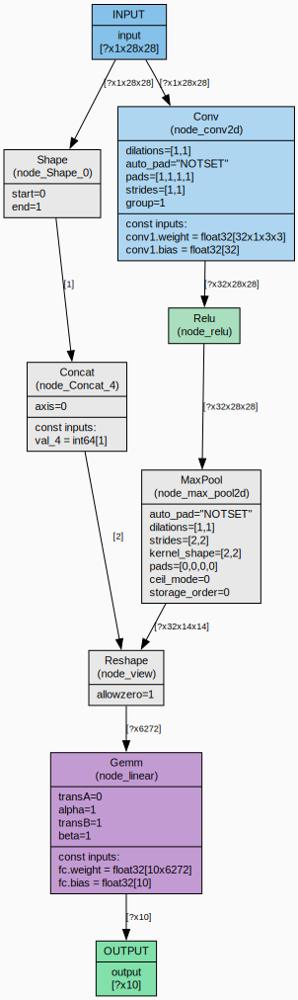

# TCompiler

A project of tensor compiler that loads ONNX models and transforms them into MLIR IR

## Features

- Load ONNX models (`.onnx`)
- Internal graph representation with:
  - Operations: `Add`, `Mul`, `MatMul`, `Conv2d`, `Gemm`, `Relu`, `Shape`, `Reshape`, `Concat`. See below for more information about operations support
  - Tensors (data type, shape, raw data for constants/weights)
  - Attributes (full support for all ONNX attribute types: float, int, string, tensor, graph, lists, etc.)
- Topological sorting of graph nodes (Kahn’s algorithm)
- Export to GraphViz DOT format
- Generating a MLIR representation of the loaded model, saving it to a file
- Testing using GoogleTest.

## Dependencies

- **C++20** compiler
- **CMake** 3.20 or higher
- **Protobuf** (libprotobuf) – used for ONNX parsing
- **LLVM (MLIR)** 22.1.1 or higher
- **GoogleTest** – for tests (automatically fetched via CMake)

On Ubuntu/Debian:
```
sudo apt install libprotobuf-dev protobuf-compiler graphviz
# LLVM/MLIR is typically built from source
```

On macOS with Homebrew:
```
brew install protobuf graphviz llvm
```


## Building

Clone the repository:

```
git clone https://github.com/ilyapvl/tcompiler.git
cd tcompiler
```

Create a build directory and configure:

```
mkdir build && cd build
cmake ..
```

File `onnx.proto3` will be downloaded

Build the project:

```
make
```

This will build C++ from `proto` using protobuf compiler. Files `onnx.pb.h` and `onnx.pb.cc` will be created and put in `PROTO_GEN_DIR`.

Then, these files will be produced:
- `libtc_lib.a` – static library
- `tcompiler` – executable

## Usage

### Command line

```
./tcompiler <model.onnx> [mlir-opptions...]
```

- `<model.onnx>` – input ONNX model file.

| Option | Description |
|-|-|
| --print-mlir | Print MLIR before optimisation |
| --mlir-out <path> | Write MLIR module to file |

### Example

```
./tcompiler ../models/test_ops.onnx --print-mlir --mlir-out output.mlir
```

File `graph.dot` with a DOT representation of a graph will be created.

The program also prints debug info:
- Model metadata (version, producer, etc.)
- Graph summary (number of nodes, tensors, inputs, outputs, operation breakdown)
- Topological order of nodes

Example of graph visualizing:

<p align="center">
  
  <br>
</p>

## Project Structure

```
.
├── CMakeLists.txt
├── include/
│   ├── graph/
│   │   ├── attribute.hpp
│   │   ├── graph.hpp
│   │   ├── node.hpp
│   │   └── tensor.hpp
│   ├── frontend/
│   │   └── onnx_loader.hpp
│   ├── middle_end/
│   │   └── mlir_gen.hpp
│   └── visualization/
│       └── dot_exporter.hpp
├── src/
│   ├── graph/
│   │   ├── attribute.cpp
│   │   ├── graph.cpp
│   │   ├── node.cpp
│   │   └── tensor.cpp
│   ├── frontend/
│   │   └── onnx_loader.cpp
│   ├── visualization/
│   │   └── dot_exporter.cpp
│   ├── middle_end/
│   │   └── mlir_builders.cpp
│   ├── backend/
│   │   └── mlir_gen.cpp
│   └── main.cpp
├── tests/
│   ├── ...
└── README.md
```

## Currentry implemented operations
### Add/Mul

Addition/multiplication of two tensors A and B. Supports NumPy‑style broadcasting. The result is a tensor with the shape obtained after broadcasting. For example, `Add(tensor1<?x5x32x32>, tensor2<1x1>) = tensor3<?x5x32x32>`


### MatMul

Performs matrix multiplication. If tensors have rank > 2, the leading dimensions are treated as batch dimensions and multiplication is performed for each matrix pair in the batch. For example, `MatMul(tensor1<?x3x4x5>, tensor2<1x5x6>) = tensor3<?x3x4x6>`


### Gemm
General matrix multiplication. Computes `Y = alpha * A * B + beta * C` with transpositions of matrix dimensions possible. Built on `Add`, `Mul` and `MatMul`.


### Relu
Returns `max(0, x)` elementwise


### Shape
Returns the shape of the input tensor as a 1D integer tensor. For example, `Shape(tensor1<?x3x5x5>) = tensor2<4>` with values `[tensor.dim, 3, 5, 5]`


### Reshape
Transforms a tensor to a new shape. Allowed values in shape tensor are `positive_integer`, `0`, `-1` where `0` means either "take from input" (`allowzero == false`) or "set explicitly to zero" (`allowzero == true`), and `-1` means infer the dimension from other. No more than one `-1` dimension is allowed. For example, `Reshape(tensor1<?x3x32x32>, tensor2<3> [0, -1, 16]) = tensor3<?x192x16>`. Be careful when reshaping tensors with dynamic dimensions


### Concat
Returns the concatenated by `axis`. For example, `Concat(tensor1<2x3x4x4>, tensor2<2x2x4x4>, axis = 1) = tensor3<2x5x4x4>`


### Conv2d
Returns 2d convolution of a tensor. Input and kernel must have `rank = 4`. Supports grouped convolution. For example, `Conv2d(input<1x8x32x32>, kernel<12x2x3x3>, group = 4) = tensor<1x12x30x30>`


## Testing

Run all tests:

```
cd build
ctest
```

Or run the test executable directly:

```
./tests/tc_tests
```

## Limitations

- External data (weights stored in separate files) are not yet supported. Only single-file models
- Reshape sometimes fail to handle shape tensors with `-1` when applied to an input with dynamic dimension. That is not usually an issue because most widely used batch tensors with shape `<?x...const...>` are processed correctly. Things like `<?x?x...>` will most likely fail.
- MLIR to LLVM and further translation via pass manager is not implemented. Use mlir-opt, mlir-translate.
